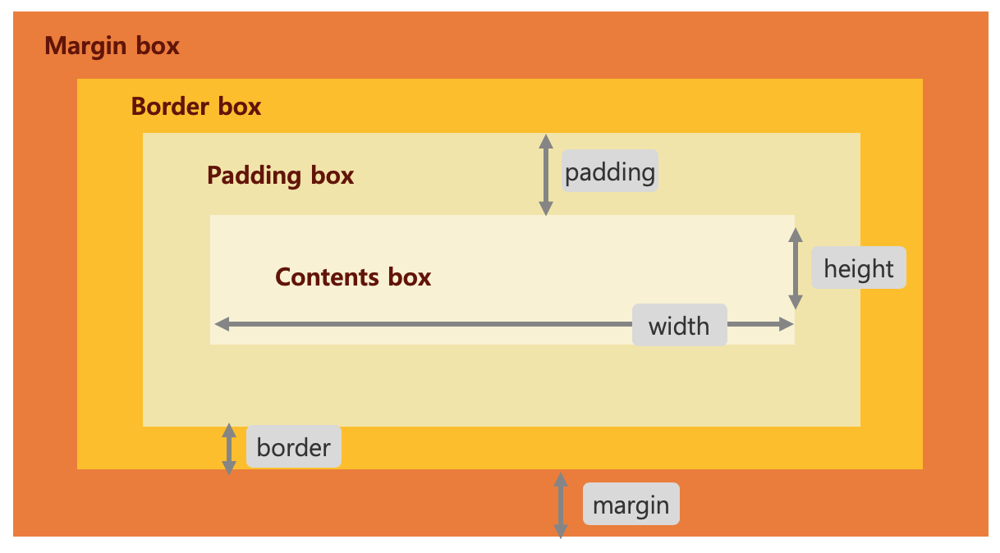

# 001 CSS study

[TOC]


## 기초

- Cascading Style Sheet

- CSS 는 HTML과 함께 웹을 구성하는 기본 요소이다.
  HTML이 텍스트나 이미지와 같은 웹문서의 구조를 이루고,
  CSS는 색상, 이미지 크기, 위치 등의 웹문서의 디자인을 담당한다.

- PC, 스마트폰 등 다양한 기기에 맞추는 반응형 디자인을 지원한다.

- 크기 단위

  - px : 모니터 해상도의 한 화소인픽셀을 기준으로한다.
         고정 단위 : 픽셀은 크기가 변하지 않음
  - % : 상대적인 단위, 
          ex) 상위 요소의 width가 100px이고, 하위 요소의 width가 80% 이면, 80px로 화면에 출력
  - em: 상대적인 단위, 글자 크기가 기준이됨.
          ex) 글자크기가 10px 라면, 요소의 width를 2em 지정하게 되면, 30px(10 * 2) 가 된다.

- 색상 단위

  - 17가지의 표준색을 포함하여 140개 정도의 색상 이름이 존재한다.

    ```css
    aqua, black, blue, fuchsia, gray, green, lime, maroon, navy, olive, orange, purple, red, silver, teal, white, yellow
    ```

  - RGB : 빛의 삼원색으로 다양한 색상을 코드로 표현

    ```css
    RGB(255, 0, 0) // red
    RGB(0, 255, 0) // green
    RGB(0, 0, 255) // blue
    ```

  - HEX :  RGB의 숫자 값을 16진수로 변환하여 연결하여 숫자로 표현한 색상값

    ```css
    #ffcc00 // ff + cc + 00 , R + G + B
    ```

- 기본 문법

  - CSS는 **선택자**(selector)와 **선언부(declaration)**로 구성
    선택자{ 속성:값;  속성:값; 속성:값}

    ```css
    /* 주석: h1 태그의 색상을 파란색으로, 크기는 10px로 지정 */
    h1 {color:blue; font-size:10px;}
    ```

- Cascading 

  - 상위 태그에서 정의된 Style 속성은 하위 태그로 상속된다
  - 상위 태그에서 정의된 Style 속성은 하위 태그에서 변경할 수 있다.

  ```
  <!-- 
  body 태그 안에 있는 모든 태그 요소들은 파란색 글자로 표시되나,
  h2는 빨간색으로 표시됨
  -->
  <body style="color:blue">
      <h1>Hello CSS</h1>
      <h2 style="color:red">Good day</h2>
  </body>
  ```

  

- 우선순위

  - 동일한 style 속성이 인라인/내부/외부/브라우저 style 속성으로 존재할 경우의 우선순위
  - 웹브라우저 자체도 내부적인 css를 가진다

  ```
  /* 높은순위 -> 낮은순위
  인라인  > 내부 > 외부 > 브라우저
  ```

  

## CSS 적용 방법

- 인라인 CSS

  ```html
  <html>
  <head>
  </head>
  
  <body>
  	<h1 style="color:blue; margin-left:30px;"> Hello CSS</h1>
  </body>
  </html>
  ```
  
  
  
- 내부 CSS

  ```css
  <html>
  <head>
      <style>
  
      h1 {
          color: blue;
          margin-left: 30px;
      } 
      </style>
  </head>
  
  <body>
  	<h1> Hello CSS</h1>
</body>
  </html>
  ```
  
- 외부 CSS

  - mytest.css

    ```css
    h1 {
        color: blue;
        margin-left: 30px;
    }
    ```

  - mytest.html

    ```html
    <html>
    <head>
    	<link rel="stylesheet" type="text/css" href="mytest.css" />
    </head>
    
    <body>
    	<h1> Hello CSS</h1>
    </body>
    </html>
    ```

    

## 선택자(selector)와 스타일 속성(style attibute)

#### selector

- style 적용 대상을 정의
- 태그 , 아이디, 클래스를 selector로 사용한다.

| selector       | 사용 예                           | 설명                                                         |
| -------------- | --------------------------------- | ------------------------------------------------------------ |
| .class         | .myclass { color: red; }          | html 태그에서 myclass로 지정된 class 선택<br /><div class="myclass">  </div> |
| #id            | #myid { color: blue; }            | html 태그에서  id가 myid인 태그 선택<br /><div id="myid"> </div> |
| *              | *                                 | html 내의 모든 태그를 선택                                   |
| 태그           | p {    color: red; }              | html 내의 모든 <p> 태그 선택                                 |
| 태그, 태그     | div, p {color: blue;}             | html 내의 모든 <div> 와 <p> 태그 선택                        |
| 태그 태그      | div p {color: blue;}              | html 내의  <div> 태그 안에 있는 모든  <p> 태그 선택          |
| 태그.class     | p.myclass{color:blue;}            | class가 myclass인 p 태그 선택                                |
| .class, .class | .myclass, .myclass2 {color:blue;} | myclass 와 myclass2 로 지정된 태그 선택                      |


#### style attribute

- ###### 텍스트 속성

  - color: 글자색 지정	
  - text-align: 주어진 영역에서 글자의 정렬 방식 지정(left/right/center/justify )
                       justify  양쪽 정렬	

- 폰트 속성

  - 폰트 유형
    - Serif:               바탕체 계열의 폰트. 	    Times New Roman, Georgia
    - Sans-serif:     굴림 계열의 폰트.             Arial, Verdana
    - Monospace:  고정폭 폰트.                      Courier New, Lucida Console
  - 폰트 이름에 공백이 있는 경우 "" 로 감싸야한다.
  - 여러 폰트를 지정할때는 나열한 순서로 폰트가 적용되며,
    마지막은 폰트 유형으로 지정하는 것이 좋다.
  - font-style : 폰트 스타일 (normal, italic)
  - font-size : 폰트 크기
  - font-weight : 폰트 두께 (normal, bold, bolder)
  - font-variant: 폰트의 변형을 지정하는 속성 (normal, small-caps)
                           small-caps 은 소문자 크기를 유지하며 대문자로 변형해주는 속성

  ```css
  h1 {
      font-family: "Times New Roman", verdana, arial, serif;
      font-style: italic;
      font-size: 10px;
      font-weight: bold;
          
  }
  ```

- 정렬 속성

  - text-align: 주어진 영역에서 글자의 정렬 방식 지정(left/right/center/justify  )
                        justify  양쪽 정렬 	
  - vertical-align: 인라인 혹은 테이블 셀에서 수직 정렬 (baseline/sub/super/top/text-top/middle/bottom/text-bottom/<percentage>/ <length>/inherit)

- 링크 속성

  - 하이퍼링크 태그인 <a> 의 속성 
  - <a> 태그에 적용되는 가상 selector , 속성은 color, background-color, text-decoration 등이 사용된다.
    - a:link - 방문한적 없는 기본 링크
    - a:visited - 방문한 링크
    - a:hover - 마우스가 링크위에 올라갔을 때
    - a:active - 링크를 클릭 했을 때

  ```css
  a:link {
    color: red;
    text-decoration: none;
  }
  
  a:visited {
    color: blue;
    text-decoration: none;
  }
  
  a:hover {
    color: hotpink;
    text-decoration: underline;
  }
  
  a:active {
    background-color: blue;
    text-decoration: underline;
  }
  ```

  

- 컬러 속성

  - 색상 표현
    - 색상이름: red
    - RGB: RGB(255, 0, 0)
    - HEX: #FF0000
  - 색조(Hue)/채도(Saturation)/밝기(Lightness)
    - HSL (9, 100%, 64%)
  - 투명도(Alpha)
    - 0.0(완전투명) ~ 1.0(완전 불투명)
    - RGB**A**( 255, 0, 0, **0.5**) 
    - HSL**A**(9, 100%, 64%, **0.5**)

  ```
  #myid1 { color: red; }
  #myid2 { color: #FF0000; }
  #myid3 { color: rgb(255, 0, 0); }
  
  #myid11 { color: rgba(255, 99, 71, 0.5) }
  #myid12 { color: hsla(9,100%, 64%, 0.5) }
  ```

  

- 배경 속성

  - 색상이나 이미지를 배경으로 지정하는 속성
    - background-color: 글자색 지정
    - background-image: 배경이미지 지정, 상대경로, 절대경로, url 사용가능
    - background-repeat: 이미지 반복
    - background-position: 이미지의 위치를 지정
    - background-attachment: 이미지의 스크롤이나 고정을 지정함

  ```
  body {
    background-image: url("mybg.png");
    background-repeat: no-repeat;
    background-position: right top;
    background-attachment: fixed;
  }
  ```


#### 박스 모델

html 문서의 구성요소들은 기본적으로 박스형태로 정의된다.
웹페이지의 레이아웃은 이러한 박스들을 위/아래/좌/우로 적절하게 배치하는 것을 의미한다.

##### 박스 구성 요소

박스 모델은 테두리(border) / 내용(content) 으로 나뉘고,
테두리(border) 의 안쪽 여백(margin) / 바깥쪽 여백(margin) 으로 구성된다.
이 네가지 요소는 상,하,좌,우 네 영역을 개별적으로 설정할 수 있다.

- Margin box - 박스의 외부 영역으로 바로 앞 박스와의 여백.

- Border box - 박스를 둘러싼 테투리 영역.

- Padding box - 테투리와 콘텐츠 사이의 안쪽 여백.

- Contents box - 콘텐츠 영역으로 텍스트 및 이미지의 실제 영역

  



```javascript
div {
  width: 320px;
  padding: 10px;
  border: 5px solid gray;
  margin: 0;
}
```

##### 박스 크기

박스 요소에 크기를 지정하면 기본적으로 contents 영역에 적용된다. 실제 박스 크기는 margin,  border, padding을 더해야 한다.

##### border 속성

- border-width : 테두리 두께
- boder-style : 테두리 모양 (실선, 점선, 이중선 등)
- border-color : 테두리 색상
- border-radius : 테두리 모서리의 둥글기 정도를 지정, 반지름의 크기를 px 나 % 로 지정

```css
div {
  border-width: 2px 5px 3px 20px;  /* top, right, bottom, left */
  border-width: 2px 10px;  /* top bottom, right left */
}
```

##### 단축형(Shorthand)

CSS의 많은 속성들은 여러 속성들을 묶어 단축형으로 사용 가능하다.
ex) border의 경우 width, style, color 순으로 나열하면 된다.

```css
div {
  border: 5px solid red;       /* 전체 테두리 witdh, style, color */
  border-left: 5px solid red;  /* 좌측 테두리 witdh, style, color */
}
```

##### margin 속성

박스와 인접 요소간의 여백, 박스간의 적절한 배치를 위해 사용하거나, 박스를 가운데 정렬할 때 사용할 수도 있다.

```css
p {margin: 10px 5px 15px 20px;} /* top-10px, right-5px, bottom-15px, left-20px */ 
p {margin: 10px 5px 15px;} 		/* top-10px, right & left-5px, bottom-15px */ 
p {margin: 10px 5px;} 			/* top & bottom-10px, right & left-5px */ 
p {margin: 10px;} 				/* All 10px */
```


#### next()

next

```javascript
next
```


